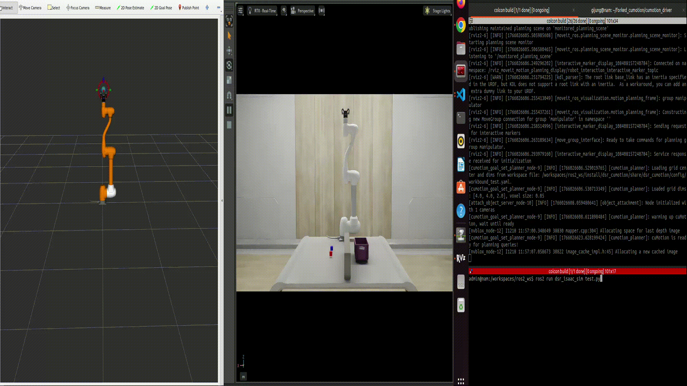

.. _nvblox_tutorial:

nvblox Tutorial
=================

Overview
--------

This tutorial explains how to use NVIDIA’s nvblox library for cuMotion-based obstacle avoidance motion planning.
It also describes how to integrate Isaac Sim so that the simulated environment inside Isaac Sim is reconstructed as obstacles using nvblox, enabling obstacle-aware motion planning with cuMotion in a simulation environment.

.. note::

   This tutorial is based on the following validated environment:

   - Isaac ROS: **Release 3.2**
   - NVIDIA Driver: **570**
   - CUDA: **12.8** (Docker base: 12.6)
   - ROS 2: **Humble**
   - Isaac Sim: **4.5**

.. raw:: html

    
    

System Prerequisites
-------------------------------------------------

Before proceeding with this tutorial, you must complete the :doc:`Isaac Sim Tutorial <../basic_tutorials/isaac_sim_tutorial>` and verify that Isaac Sim is installed and running correctly.
In addition, complete the :doc:`cuMotion Tutorial <../basic_tutorials/cumotion_tutorial>` to ensure that cuMotion is functioning properly.
This tutorial should be followed only after both prerequisite tutorials have been successfully completed.

.. warning::

    - This tutorial describes nvblox usage based on **Release 3.2**. Some details may differ when using other versions.
    - nvblox requires a high-performance GPU. Please ensure that your system meets the recommended hardware requirements.

.. raw:: html

    
    

Workspace Setup
----------------------

This section explains how to install and configure the nvblox package.

**1. Clone the nvblox package**

Use the following command to clone the nvblox package into your ROS 2 workspace.

.. code-block:: bash

    cd ~/workspaces/isaac_ros-dev/src
    git clone --recursive -b release-3.2 https://github.com/NVIDIA-ISAAC-ROS/isaac_ros_nvblox.git

**2. Install dependencies and build**

Use the following commands to install dependencies and build the workspace. (The same code used in the previous cuMotion tutorial is used here.)

.. code-block:: bash

    cd ~/ros2_ws/src/cumotion/dsr_cumotion/docker
    chmod +x startup-doosan.sh
    ./startup-doosan.sh

    cd ~/workspaces/isaac_ros-dev/src/isaac_ros_common/scripts
    ./run_dev.sh

If you encounter dependency-related issues during rebuild, run the following commands inside the docker and then rebuild.

.. code-block:: bash

    cd ~/workspaces/isaac_ros-dev/src/isaac_ros_nvblox
    rosdep update
    rosdep install --from-paths src --ignore-src -r -y
    
    cd ~/workspaces/isaac_ros-dev
    colcon build

    source /opt/ros/humble/setup.bash
    source /workspaces/isaac_ros-dev/install/setup.bash
    source /workspaces/ros2_ws/install/setup.bash

Launching nvblox with cuMotion
------------------------------------------

This section explains how to run the launch code. This tutorial is executed in a virtual environment.

Command
~~~~~~~~

**1. Launch cuMotion and nvblox**

  .. code-block:: bash

     ros2 launch dsr_cumotion start_cumotion_isaacsim.launch.py \
       mode:=virtual host:=127.0.0.1

.. raw:: html

    

**2. Launch Isaac Sim**

This command should be run inside the Isaac Sim docker, not the Isaac ROS docker.

  .. code-block:: bash

    cd ~/ros2_ws/src/doosanrobotics_cumotion_driver/dsr_isaac_sim
    chmod +x run_isaac_sim.sh
    ./run_isaac_sim.sh
    ./python.sh $ROS2_WS/dsr_isaac_sim/isaac_sim/isaac_sim.py

.. note::

    - This launch file runs both the cuMotion and nvblox nodes together. If you want to modify the current nvblox settings, edit the dsr_cumotion/config/nvblox_node.yaml file.

**3. Run the demo code**

Open a new terminal, connect to the container using the command below,
and then run the demo code with the following command.

  .. code-block:: bash
        
        docker exec -it -u admin isaac_ros_dev-x86_64-container bash
        ros2 run dsr_isaac_sim isaac_demo.py

.. raw:: html

    
    

References
----------

- `Isaac Sim Documentation <https://docs.isaacsim.omniverse.nvidia.com/4.5.0/introduction/quickstart_index.html>`_
- `nvblox Documentation <https://nvidia-isaac-ros.github.io/concepts/scene_reconstruction/nvblox/index.html>`_
- `nvblox package documentation <https://nvidia-isaac-ros.github.io/repositories_and_packages/isaac_ros_nvblox/index.html>`_