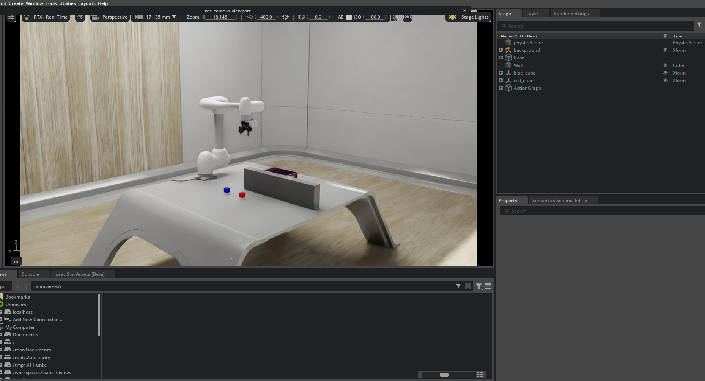

.. _isaac_sim_tutorial:

Isaac Sim Integration
=====================

Overview
--------

**NVIDIA Isaac Sim** is a high-fidelity robotics simulation platform designed for developing,
testing, and validating robotic systems in virtual environments. It provides advanced
simulation capabilities for robots, sensors, physics, and perception pipelines.

This tutorial explains **how to use Doosan robots within the Isaac Sim environment**.
It focuses solely on **running and operating Doosan robot models in Isaac Sim** and does
not cover general Isaac Sim usage or advanced scene authoring.

.. note::

   This tutorial has been validated with the following environment:

   - NVIDIA Driver: **570**
   - CUDA: **12.8**
   - ROS 2: **Humble**
   - Isaac Sim: **4.5**

.. raw:: html

     

System Prerequisites
--------------------

Before proceeding with this tutorial, you **must complete the official Isaac Sim installation**
provided by **NVIDIA**. Only after successfully installing Isaac Sim should you continue with
the Doosan + Isaac Sim integration steps described here.

Please follow the official NVIDIA guide:

`Official Isaac Sim Container Installation Guide <https://docs.isaacsim.omniverse.nvidia.com/4.5.0/installation/install_container.html>`_

.. warning::

   - This tutorial is based on **Isaac Sim 4.5**. Other versions may have differences in APIs,
     container structure, or ROS 2 bridge behavior.
   - Isaac Sim requires a **high-performance NVIDIA GPU**. Verify that your system meets
     the official hardware requirements.
   - This tutorial assumes **Docker-based execution**. For native (local) installation,
     refer to NVIDIA’s official documentation.

.. raw:: html

     

Workspace Setup and Execution
-----------------------------

This section describes how to set up the required ROS 2 workspace, install the Doosan
Isaac Sim assets, and run Isaac Sim with Doosan robot models.

1. Create a ROS 2 Workspace and Clone Doosan Packages
^^^^^^^^^^^^^^^^^^^^^^^^^^^^^^^^^^^^^^^^^^^^^^^^^^^^^

Create a ROS 2 workspace and clone the Doosan Robotics packages.  
The **dsr_isaac_sim** package is included inside the
**doosanrobotics_cumotion_driver** repository.

.. code-block:: bash

   mkdir -p ~/ros2_ws/src
   cd ~/ros2_ws/src
   git clone -b humble https://github.com/DoosanRobotics/doosanrobotics_cumotion_driver

2. Run the Isaac Sim Docker Container
^^^^^^^^^^^^^^^^^^^^^^^^^^^^^^^^^^^^^

Move to the Isaac Sim launcher directory and run the provided Docker execution script.

.. important::

   This script assumes that the **Isaac Sim 4.5 Docker image has already been pulled**
   according to the official NVIDIA instructions. It does not pull the image automatically.

.. code-block:: bash

   cd ~/ros2_ws/src/doosanrobotics_cumotion_driver/dsr_isaac_sim
   chmod +x run_isaac_sim.sh
   ./run_isaac_sim.sh

This command launches an interactive shell inside the Isaac Sim Docker container.

3. Launch Doosan Robot in Isaac Sim
^^^^^^^^^^^^^^^^^^^^^^^^^^^^^^^^^^^^

Inside the Docker container, run the following command to start Isaac Sim with
the Doosan robot scene.

Custom scripts can be added and executed from the same directory if needed.

.. code-block:: bash

   ./python.sh $ROS2_WS/dsr_isaac_sim/isaac_sim/isaac_sim.py

Once launched, Isaac Sim will open with the Doosan robot model loaded.

.. raw:: html

     

USD Model Description
---------------------

The Doosan Isaac Sim package includes USD files for the **Doosan M1013** robot model.
Each USD file represents a different sensor and gripper configuration.

- **m1013.usd**  
  Base Doosan M1013 robot model without additional sensors or grippers.

- **m1013_d435i.usd**  
  M1013 robot model equipped with an **Intel RealSense D435i** camera.

- **m1013_gripper.usd**  
  M1013 robot model equipped with a **Robotiq 2F-85 gripper** and **D435i camera**.

.. list-table::
   :widths: 33 33 33
   :align: center

   * - .. container:: align-center

          .. image:: ../images/isaac_sim/m1013.png
             :width: 200px

          **No Gripper**

     - .. container:: align-center

          .. image:: ../images/isaac_sim/d435i.png
             :width: 200px

          **D435i Camera**

     - .. container:: align-center

          .. image:: ../images/isaac_sim/gripper.png
             :width: 200px

          **Robotiq 2F-85 + D435i**

.. raw:: html

     

References
----------

- `Isaac Sim Documentation <https://docs.isaacsim.omniverse.nvidia.com/4.5.0/introduction/quickstart_index.html>`_
